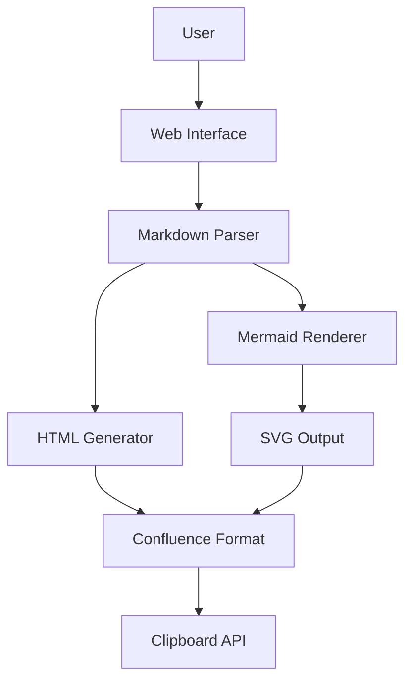
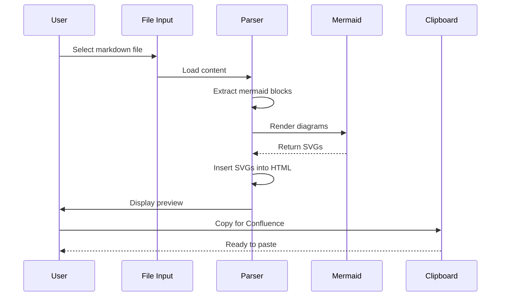
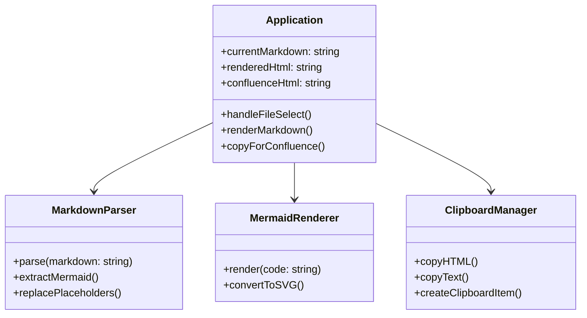
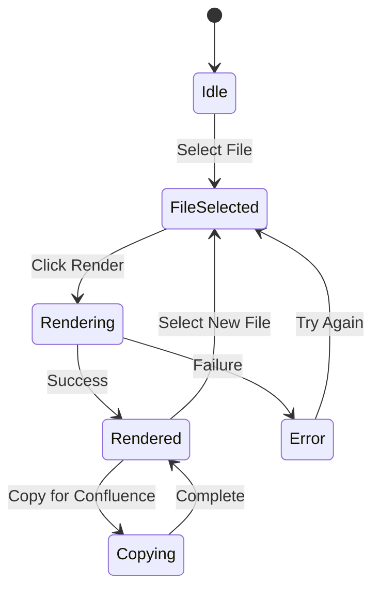
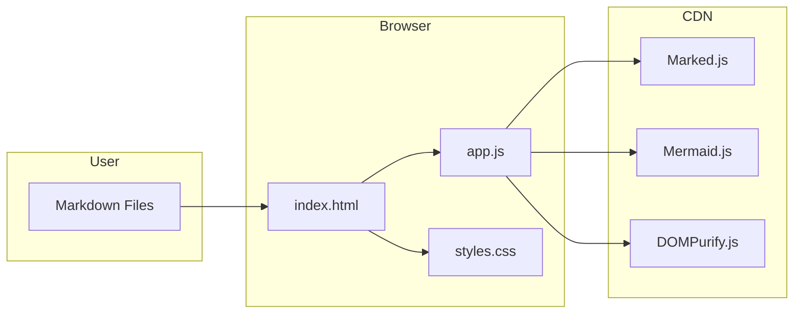
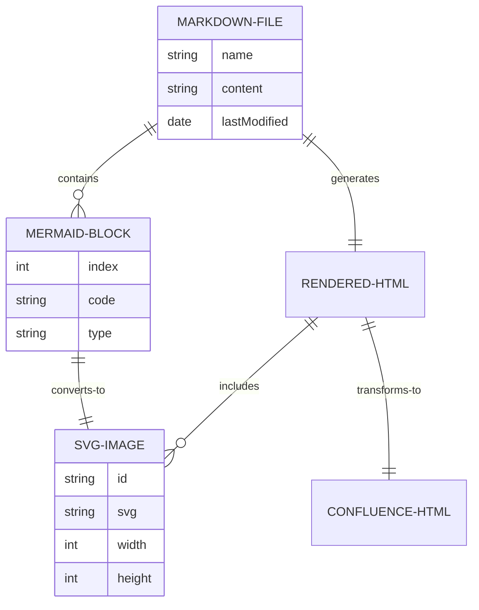
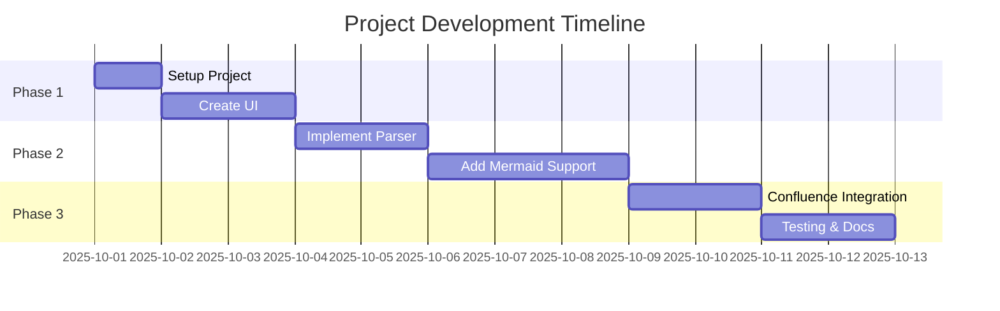
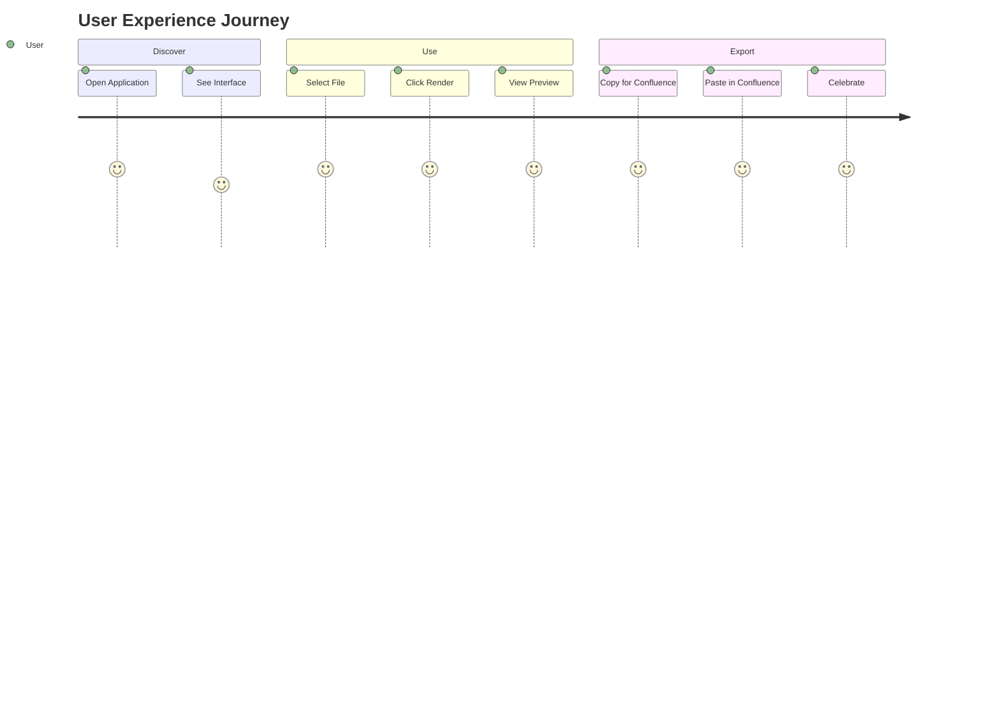

# Project Architecture

This is a comprehensive markdown document with various Mermaid diagrams to demonstrate the converter's capabilities.

## System Overview

## Application Flow

The application follows a simple but effective workflow:

## Component Architecture

## State Machine

## Deployment Diagram

## Entity Relationship

## Timeline

## User Journey

## Key Features

1. **Simple Interface**: Clean, modern design
2. **Fast Rendering**: Efficient parsing and conversion
3. **Confluence Ready**: One-click copy functionality
4. **SVG Quality**: High-quality diagram output
5. **No Installation**: Works directly in browser

## Technical Stack

| Component | Technology |
|-----------|-----------|
| Parser    | Marked.js |
| Diagrams  | Mermaid.js |
| Security  | DOMPurify |
| Frontend  | Vanilla JS |
| Styling   | CSS3 |

## Conclusion

This application provides a seamless way to convert markdown documents with Mermaid diagrams into Confluence-ready content. The SVG conversion ensures high-quality diagrams that look great in Confluence pages.
