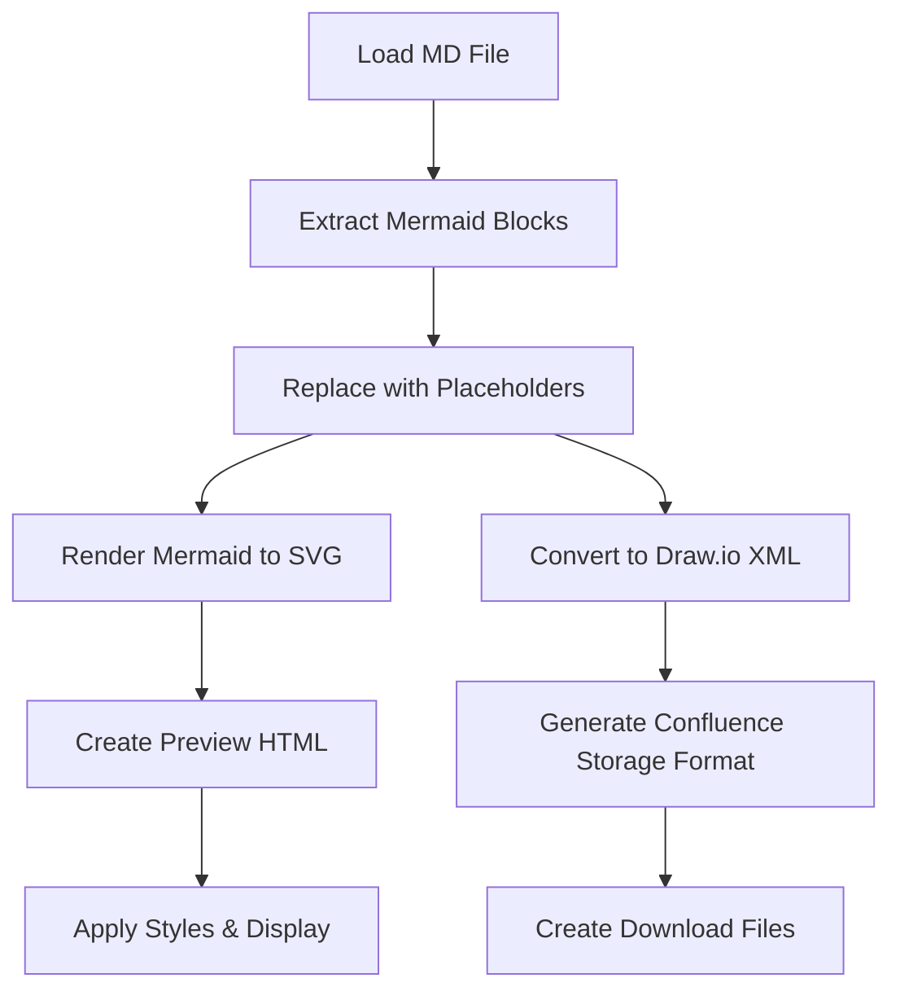

# System Patterns

## Architecture Overview

### System Type
Client-side web application - all processing happens in the browser with no server component.

```
┌─────────────────────────────────────────────────┐
│              Browser Environment                 │
│                                                  │
│  ┌──────────────┐         ┌──────────────┐     │
│  │   index.html │────────▶│   app.js     │     │
│  │   (UI)       │         │   (Logic)    │     │
│  └──────────────┘         └──────────────┘     │
│         │                         │             │
│         ▼                         ▼             │
│  ┌──────────────┐         ┌──────────────┐     │
│  │  styles.css  │         │  Libraries   │     │
│  │  (Styling)   │         │  - Marked.js │     │
│  └──────────────┘         │  - Mermaid.js│     │
│                           │  - DOMPurify │     │
│                           └──────────────┘     │
│                                                  │
│  Input: .md file  ────────▶  Output:            │
│                              - .drawio files     │
│                              - .xml (Confluence) │
└─────────────────────────────────────────────────┘
```

## Core Components

### 1. Application State (`app.js` lines 1-5)
```javascript
let currentMarkdown = '';      // Original markdown content
let currentFileName = '';      // Base filename without extension
let renderedHtml = '';         // Styled HTML for preview
let confluenceStorageFormat = ''; // Confluence XHTML output
let generatedFiles = [];       // Array of {name, blob, type, size}
```

### 2. Processing Pipeline



#### Step-by-Step Flow

1. **File Loading** (`handleFileSelect()`)
   - Read file using FileReader API
   - Store content in `currentMarkdown`
   - Enable process button

2. **Mermaid Extraction** (`processMarkdownAndSaveFiles()`)
   - Regex pattern: `/```mermaid\s*\r?\n([\s\S]*?)```/g`
   - Extract code into array
   - Replace with placeholder comments: `<!-- MERMAID_DIAGRAM_N -->`

3. **Diagram Conversion**
   - **For Preview**: `mermaid.render()` → SVG
   - **For Export**: `mermaidToDrawio()` → Draw.io XML
   - Generate .drawio file blob for each diagram

4. **Markdown Conversion** (`markdownToConfluenceStorage()`)
   - Line-by-line parsing
   - Convert each element to Confluence XHTML:
     - Headings → `<h1>`...`<h6>`
     - Lists → `<ul>`/`<ol>` with `<li>`
     - Code blocks → `<ac:structured-macro ac:name="code">`
     - Tables → `<table><tbody><tr><td>`
     - Diagrams → `<ac:structured-macro ac:name="drawio">`

5. **Preview Generation**
   - Use Marked.js to parse markdown → HTML
   - Replace diagram placeholders with SVG
   - Apply inline styles via `applyConfluenceStyles()`

6. **File Generation**
   - Create Blob for each .drawio file
   - Create Blob for -confluence.xml file
   - Store in `generatedFiles` array

## Key Technical Decisions

### Why Confluence Storage Format?
- **Native format**: Confluence uses XHTML internally
- **Full compatibility**: All features supported
- **Editable**: Diagrams remain editable post-import
- **No conversion needed**: Direct paste/import

### Why Draw.io XML?
- **Built into Confluence**: No plugin needed
- **Mermaid support**: Draw.io can render Mermaid natively
- **Editable**: Can be modified after import
- **Standard format**: Uses mxGraph XML structure

### Why Client-Side Only?
- **Privacy**: No data sent to servers
- **Simplicity**: No deployment/hosting needed
- **Speed**: Instant processing
- **Portability**: Works offline

## Design Patterns

### State Management
- Simple global state variables
- No framework needed for this scope
- State updated through functions, not direct manipulation

### Error Handling
- Try-catch blocks around critical operations
- User-friendly notifications via `showNotification()`
- Console logging for debugging
- Graceful degradation (continue processing other diagrams if one fails)

### DOM Manipulation
- Event listeners on DOM ready
- Direct DOM API (no jQuery needed)
- Template literals for HTML generation
- Temporary DOM elements for style application

### File Handling
- FileReader API for input
- Blob API for output
- URL.createObjectURL() for downloads
- Clipboard API for copy functionality

## Component Relationships

### Functions by Category

#### File Operations
- `handleFileSelect()` - Read uploaded file
- `downloadFile()` - Download individual file
- `downloadAllFiles()` - Batch download with delay
- `copyForConfluence()` - Copy XML to clipboard

#### Processing
- `processMarkdownAndSaveFiles()` - Main orchestrator
- `mermaidToDrawio()` - Convert Mermaid → Draw.io XML
- `markdownToConfluenceStorage()` - Convert Markdown → Confluence XHTML
- `convertInlineMarkdown()` - Handle bold, italic, code, links

#### Display
- `displayFiles()` - Show file list UI
- `applyConfluenceStyles()` - Add inline styles to preview
- `toggleRawHtml()` - Show/hide XML output
- `showNotification()` - Display status messages

#### Utilities
- `escapeHtml()` - Escape HTML special characters
- `escapeXml()` - Escape XML special characters (uses `replaceAll`)
- `stripHtml()` - Extract text from HTML

## Data Flow

### Input → Output
```
Markdown File
    ↓
[Extract & Parse]
    ↓
├─→ Mermaid Code → Draw.io XML → .drawio files
│
├─→ Markdown Text → Confluence XHTML
│                   ↓
│                   [Embed draw.io macros]
│                   ↓
│                   -confluence.xml file
│
└─→ Preview HTML → Browser Display
                   ↓
                   [Apply styles]
                   ↓
                   Styled Preview
```

## Library Integration

### Marked.js (v11.1.1)
- **Purpose**: Parse markdown to HTML
- **Configuration**: GFM enabled, breaks enabled
- **Usage**: `marked.parse(markdown)` for preview only

### Mermaid.js (v10)
- **Purpose**: Render diagrams to SVG (preview only)
- **Configuration**: `startOnLoad: false`, `theme: default`, `securityLevel: loose`
- **Usage**: `mermaid.render(id, code)` returns SVG string

### DOMPurify (v3.0.6)
- **Purpose**: Sanitize HTML (security)
- **Usage**: Currently loaded but not actively used (future-proofing)

## Critical Code Sections

### Mermaid Block Regex
```javascript
/```mermaid\s*\r?\n([\s\S]*?)```/g
```
- Matches mermaid code blocks
- Captures content between backticks
- Handles \r\n and \n line endings

### Draw.io XML Template
- mxGraph format with embedded Mermaid code
- Geometry: 770x600px at position (40, 40)
- Uses `shape=mxgraph.mermaid` for Mermaid support

### Confluence Macro Format
```xml
<ac:structured-macro ac:name="drawio" ac:schema-version="1">
  <ac:parameter ac:name="diagramName">...</ac:parameter>
  <ac:plain-text-body><![CDATA[...]]></ac:plain-text-body>
</ac:structured-macro>
```

## Known Limitations
- No real-time editing (must reprocess file)
- No server-side storage/persistence
- Depends on browser Blob/FileReader support
- Large files may impact browser performance
- No undo/redo functionality
