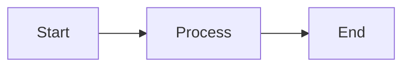
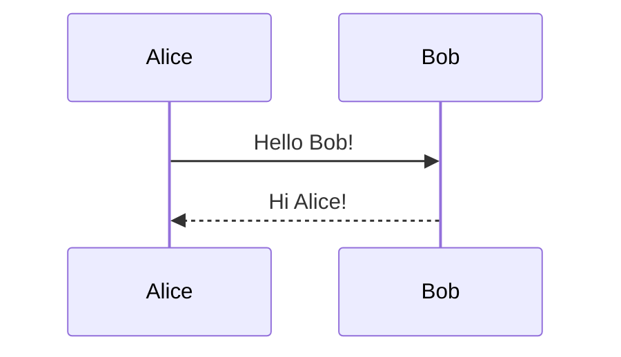

# Test Document

This is a test document with a simple Mermaid diagram.

## Simple Flowchart

## Text Content

This is some text content to test the markdown processing.

- Item 1
- Item 2
- Item 3

## Another Diagram

## Conclusion

This concludes the test document.
